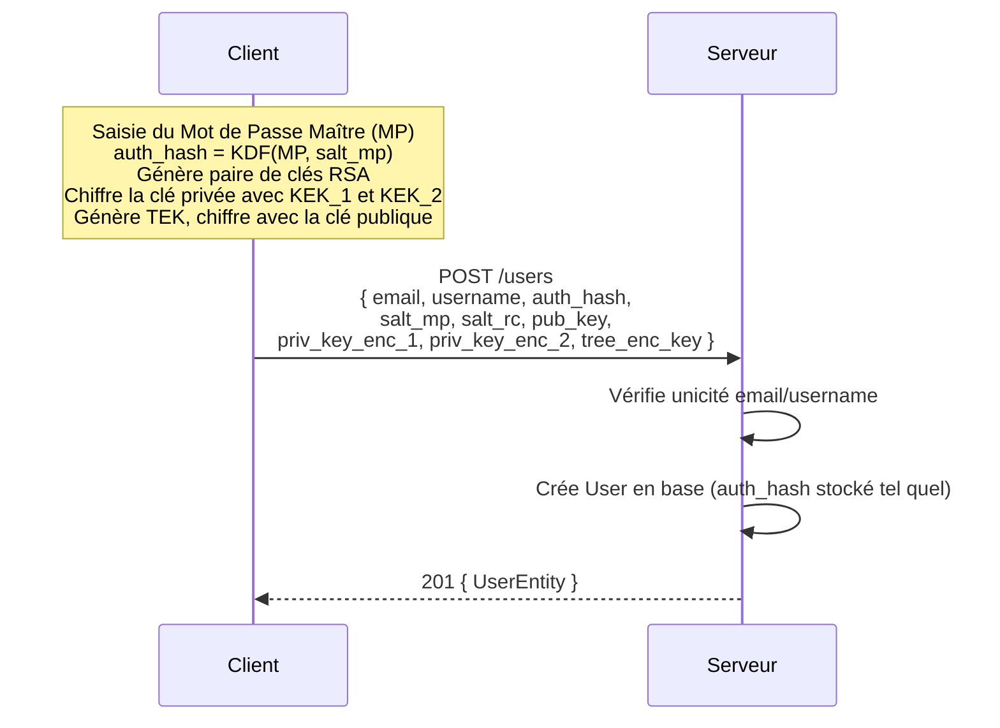
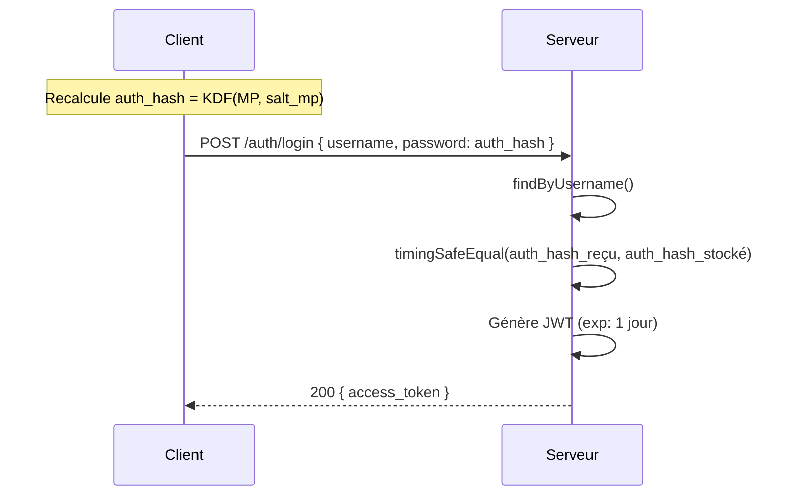
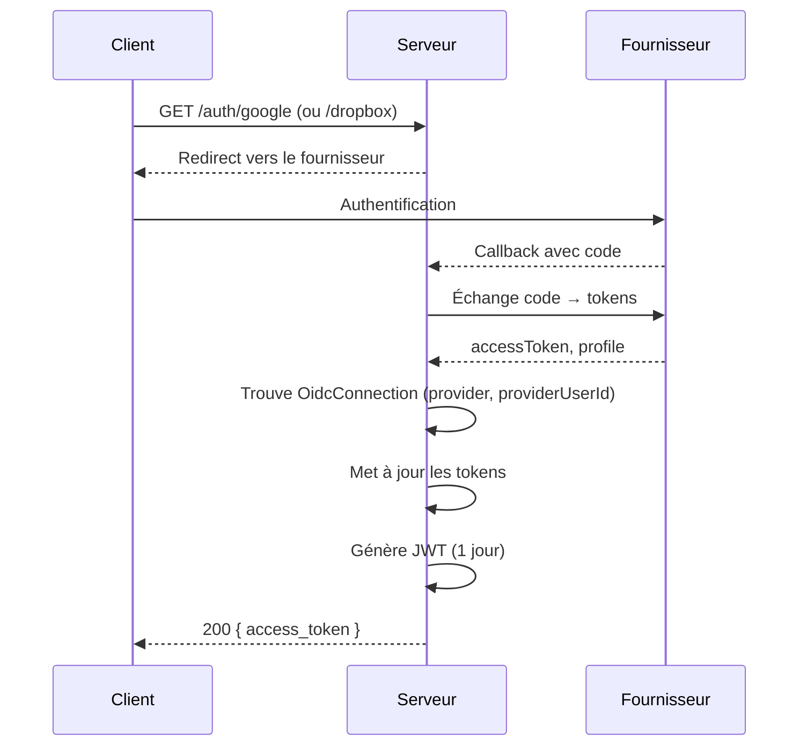
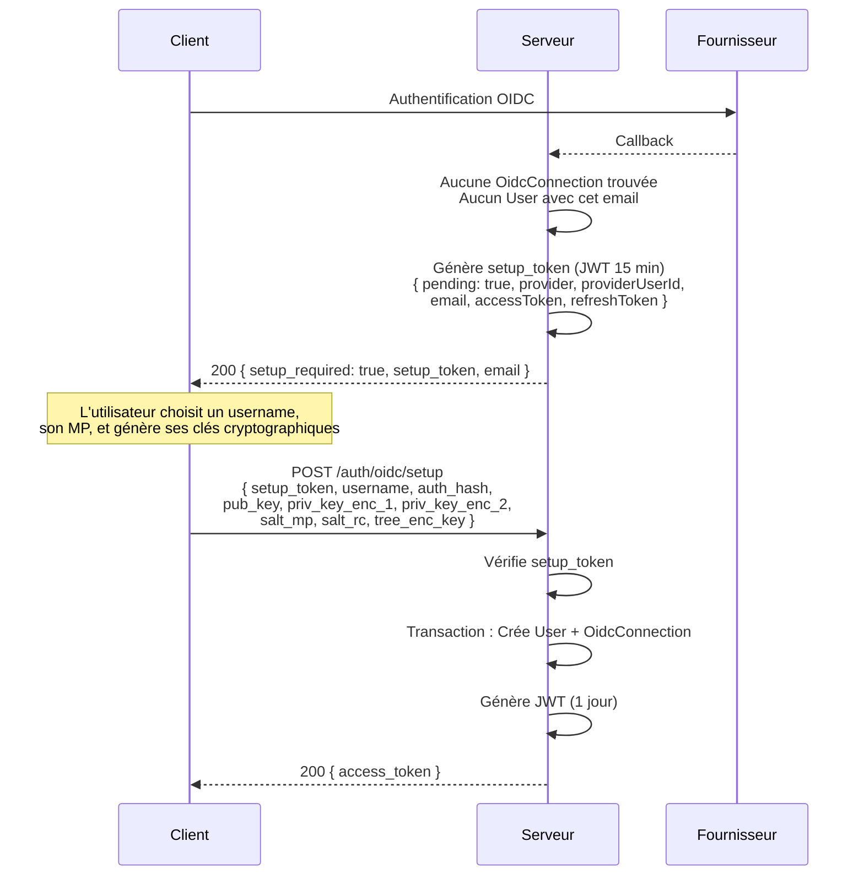
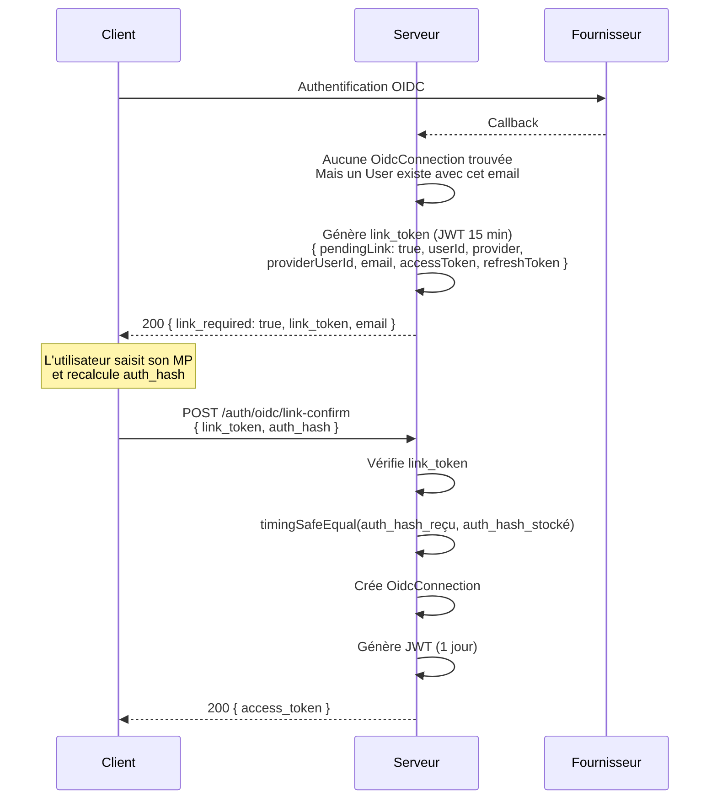
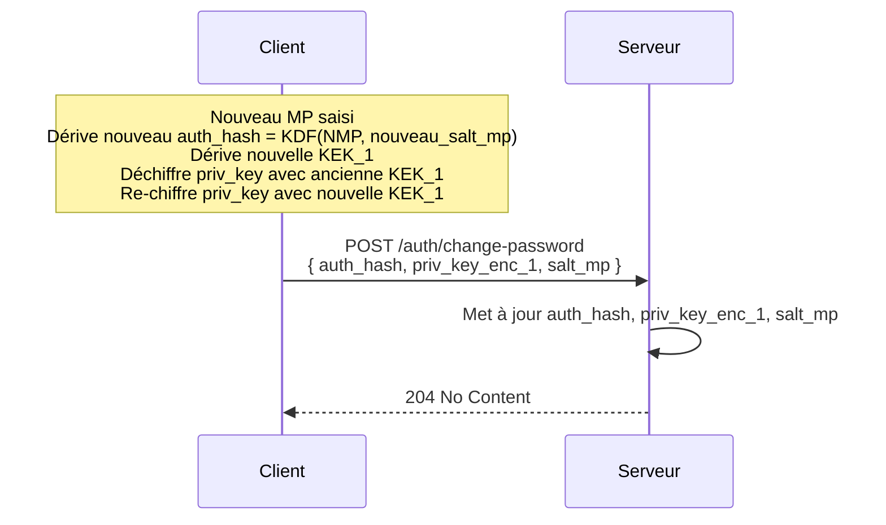

# Authentification

Ce document décrit les flux d'inscription, de connexion locale, de connexion via fournisseur OIDC (Google, Dropbox) et de double facteur (TOTP).

---

## Modèles de données impliqués

### `User`

| Champ | Description |
|---|---|
| `id` | UUID, clé primaire |
| `email` | Unique |
| `username` | Unique |
| `role` | `USER` ou `ADMIN` (défaut : `USER`) |
| `auth_hash` | Hash dérivé du mot de passe maître **côté client** — stocké tel quel, comparé par `timingSafeEqual` |
| `salt_mp` | Sel pour la dérivation de la clé maître côté client |
| `salt_rc` | Sel pour la dérivation de la clé de récupération |
| `pub_key` | Clé publique de l'utilisateur |
| `priv_key_enc_1` | Clé privée chiffrée par la KEK dérivée du mot de passe maître |
| `priv_key_enc_2` | Clé privée chiffrée par la KEK dérivée du code de récupération |
| `tree_enc_key` | Clé de chiffrement de l'arborescence (TEK chiffrée avec la clé publique) |
| `totpSecret` | Secret TOTP (null si 2FA désactivé) |
| `totpEnabled` | Booléen |

> **`auth_hash` n'est jamais calculé côté serveur.** Le client dérive `auth_hash = KDF(MP, salt_mp)` et l'envoie directement. Le serveur compare avec `timingSafeEqual` sans aucun re-hachage.

### `OidcConnection`

Un utilisateur peut avoir au plus une connexion par fournisseur (`GOOGLE` ou `DROPBOX`).

| Champ | Description |
|---|---|
| `provider` | `GOOGLE` ou `DROPBOX` |
| `providerUserId` | Identifiant chez le fournisseur |
| `email` | Email retourné par le fournisseur |
| `accessToken` / `refreshToken` | Tokens OAuth2 |
| `driveScope` | Accès Google Drive accordé |

### `TotpRecoveryCode`

Dix codes à usage unique par utilisateur, stockés hashés (SHA-256). Le nombre de codes restants (non utilisés) est retourné sur `GET /users/:id`.

---

## Inscription (compte local)

**Endpoint :** `POST /users`

Le client effectue toute la cryptographie **avant** d'envoyer la requête. Le serveur ne voit jamais le mot de passe en clair.



**Validations :**
- `409 Conflict` si l'email ou le username est déjà pris.

---

## Connexion locale

**Endpoint :** `POST /auth/login`  
**Guard :** `LocalAuthGuard` → `LocalStrategy`



> Le champ `password` du body de login reçoit **l'`auth_hash`** dérivé côté client, pas le mot de passe en clair.

**Erreurs :**
- `401 Unauthorized` si le username est inconnu, le hash incorrect, ou si le compte n'a pas d'`auth_hash` (impossible avec l'implémentation actuelle — tous les comptes ont un `auth_hash`).

**Structure du JWT :**
```json
{
  "sub": "<userId>",
  "email": "...",
  "username": "...",
  "role": "USER | ADMIN",
  "iat": 1234567890,
  "exp": 1234654290
}
```

---

## Connexion OIDC (Google / Dropbox)

Deux fournisseurs sont supportés.

### Variables d'environnement requises

| Fournisseur | Variables |
|---|---|
| Google | `GOOGLE_CLIENT_ID`, `GOOGLE_SECRET`, `GOOGLE_CALLBACK_URL` |
| Dropbox | `DROPBOX_CLIENT_ID`, `DROPBOX_CLIENT_SECRET`, `DROPBOX_CALLBACK_URL` |

### Cas 1 — Connexion OIDC existante



### Cas 2 — Premier login OIDC, email inconnu (création de compte)



### Cas 3 — Premier login OIDC, email déjà connu (liaison de compte)



### Liaison depuis un compte authentifié

Un utilisateur déjà connecté peut lier un provider OIDC depuis les paramètres. Le endpoint `POST /auth/oidc/link` accepte indifféremment un `setup_token` (email différent) ou un `link_token` (email correspondant). Puisque l'utilisateur est déjà authentifié via JWT, aucune re-vérification du mot de passe n'est nécessaire.

```
1. Utilisateur connecté → clique "Lier Google"
2. GET /auth/google → callback retourne setup_token ou link_token
3. POST /auth/oidc/link  { token: "<setup_token ou link_token>" }  + Bearer JWT
```

---

## Changement de mot de passe

**Endpoint :** `POST /auth/change-password`  
**Guard :** `JwtAuthGuard`

Le re-chiffrement de la clé privée est fait **entièrement côté client** avant l'envoi.



> `priv_key_enc_2` et `salt_rc` restent inchangés (dérivés du code de récupération, pas du MP).

---

## Double facteur (TOTP)

### Activation

**Endpoint :** `POST /users/:id/totp/enable`  
**Guard :** `JwtAuthGuard` + `SelfOrAdminGuard`

```json
Body: { "secret": "<base32-secret>" }
```

1. Génère 10 codes de récupération au format `XXXX-XXXX-XXXX-XXXX`.
2. Supprime les codes précédents en base.
3. Stocke les hashs SHA-256 des nouveaux codes dans `TotpRecoveryCode`.
4. Met à jour `totpEnabled: true` et `totpSecret` sur le User.
5. Retourne les 10 codes en clair **une seule fois**.

### Renouvellement des codes de récupération

**Endpoint :** `POST /users/:id/totp/renew-codes`  
**Guard :** `JwtAuthGuard` + `SelfOrAdminGuard`

Invalide tous les codes existants et génère 10 nouveaux codes. Retourne `400` si le TOTP n'est pas activé. Les nouveaux codes sont retournés en clair **une seule fois** — même format que l'activation.

### Désactivation

**Endpoint :** `POST /users/:id/totp/disable`  
**Guard :** `JwtAuthGuard` + `SelfOrAdminGuard`

Supprime tous les `TotpRecoveryCode` et remet `totpEnabled: false`, `totpSecret: null`.

### Récupération d'accès (code de secours)

**Endpoint :** `POST /auth/totp/recover`

```json
Body: { "username": "...", "password": "<auth_hash>", "recovery_code": "XXXX-XXXX-XXXX-XXXX" }
```

1. Valide les identifiants (`timingSafeEqual` sur `auth_hash`).
2. Vérifie `totpEnabled: true`.
3. Hache le code en SHA-256 et cherche un enregistrement non utilisé.
4. Marque le code comme utilisé.
5. Désactive le TOTP.
6. Génère un nouveau JWT.

### Codes restants

`GET /users/:id` retourne le champ `totp_recovery_codes_remaining` (nombre de codes non encore utilisés).

---

## Endpoints — récapitulatif

### Auth

| Méthode | Endpoint | Guard | Description |
|---|---|---|---|
| `POST` | `/auth/login` | Local | Connexion locale (envoie `auth_hash` dans `password`) |
| `GET` | `/auth/profile` | JWT | Profil depuis le token |
| `GET` | `/auth/google` | Google | Initie l'OAuth2 Google |
| `GET` | `/auth/google/callback` | Google | Callback Google |
| `GET` | `/auth/dropbox` | Dropbox | Initie l'OAuth2 Dropbox |
| `GET` | `/auth/dropbox/callback` | Dropbox | Callback Dropbox |
| `POST` | `/auth/oidc/setup` | Aucun | Crée un compte depuis un `setup_token` OIDC |
| `POST` | `/auth/oidc/link-confirm` | Aucun | Lie un provider en vérifiant l'`auth_hash` (`link_token`) |
| `POST` | `/auth/oidc/link` | JWT | Lie un provider depuis un compte authentifié (`setup_token` ou `link_token`) |
| `POST` | `/auth/change-password` | JWT | Changement de mot de passe maître |
| `POST` | `/auth/totp/recover` | Aucun | Récupération via code de secours TOTP |

### Users

| Méthode | Endpoint | Guard | Description |
|---|---|---|---|
| `POST` | `/users` | Aucun | Inscription |
| `GET` | `/users` | JWT + ADMIN | Liste tous les utilisateurs |
| `GET` | `/users/:id` | JWT + SelfOrAdmin | Profil + nombre de codes TOTP restants |
| `PATCH` | `/users/:id` | JWT + SelfOrAdmin | Mise à jour |
| `DELETE` | `/users/:id` | JWT + SelfOrAdmin | Suppression du compte |
| `POST` | `/users/:id/totp/enable` | JWT + SelfOrAdmin | Active le TOTP |
| `POST` | `/users/:id/totp/renew-codes` | JWT + SelfOrAdmin | Renouvelle les codes de récupération |
| `POST` | `/users/:id/totp/disable` | JWT + SelfOrAdmin | Désactive le TOTP |

---

## Guards

| Guard | Rôle |
|---|---|
| `JwtAuthGuard` | Valide le Bearer token JWT |
| `LocalAuthGuard` | Valide `username` + `auth_hash` via `timingSafeEqual` |
| `GoogleAuthGuard` | Délègue à Passport pour le flux OAuth2 Google |
| `DropboxAuthGuard` | Délègue à Passport pour le flux OAuth2 Dropbox |
| `RolesGuard` | Vérifie le rôle (`ADMIN` requis) |
| `SelfOrAdminGuard` | Autorise si `req.user.sub === :id` ou rôle `ADMIN` |
