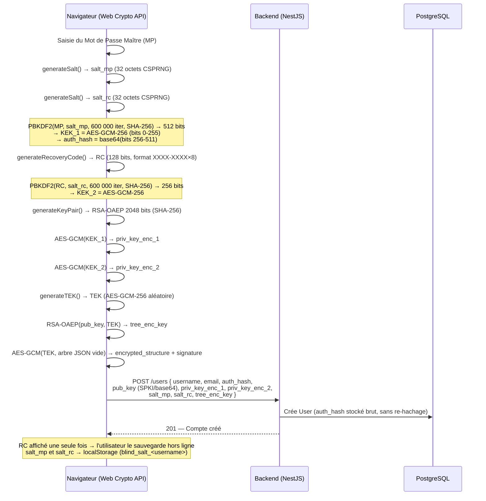
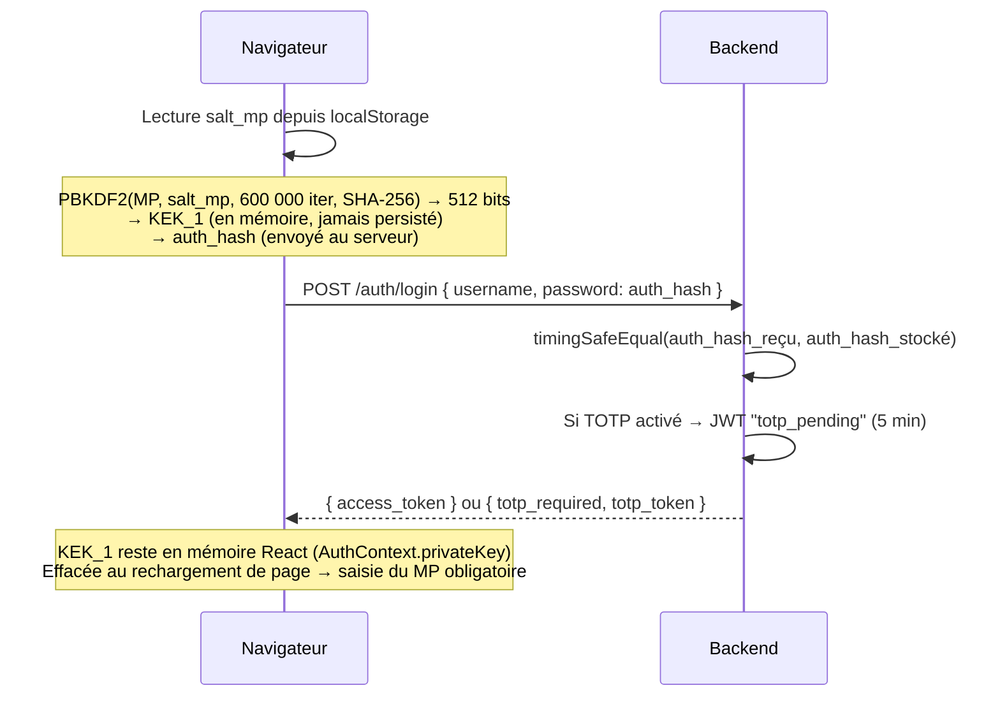
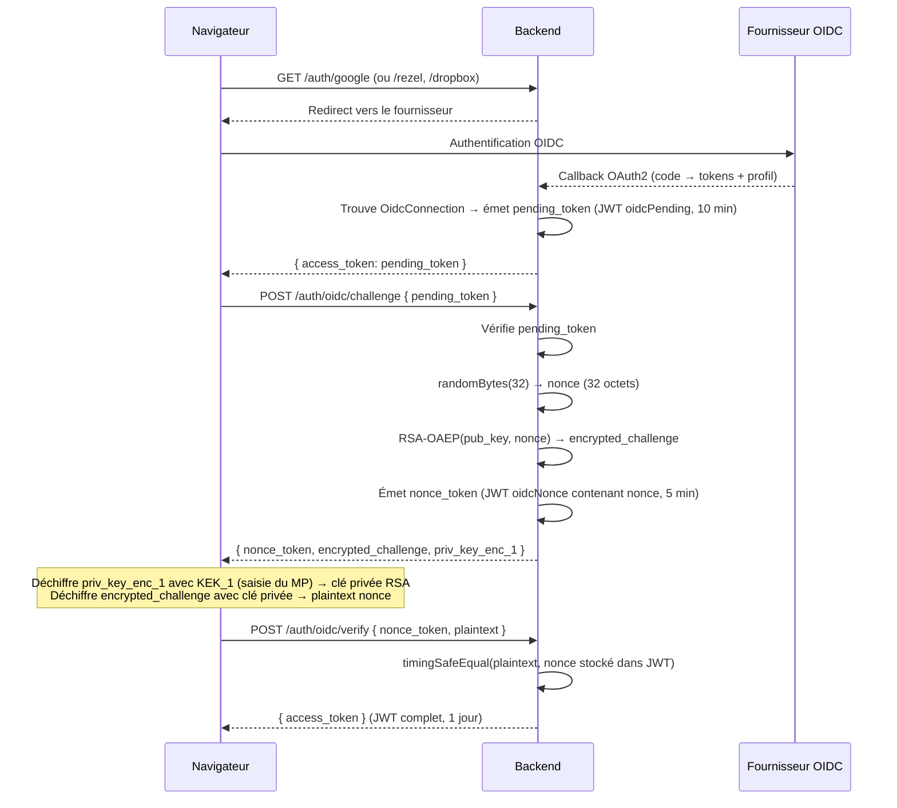
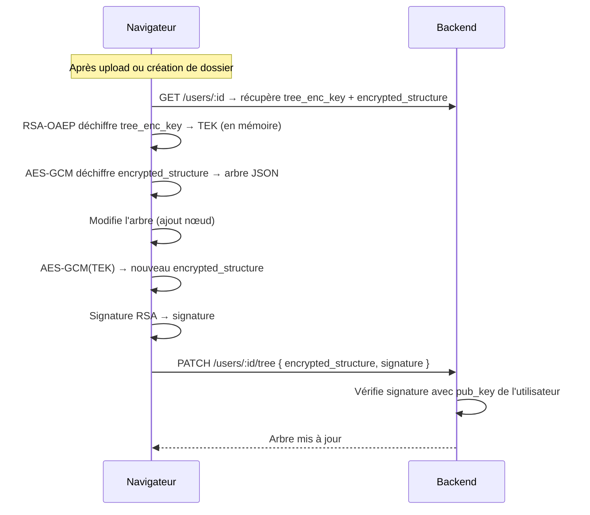
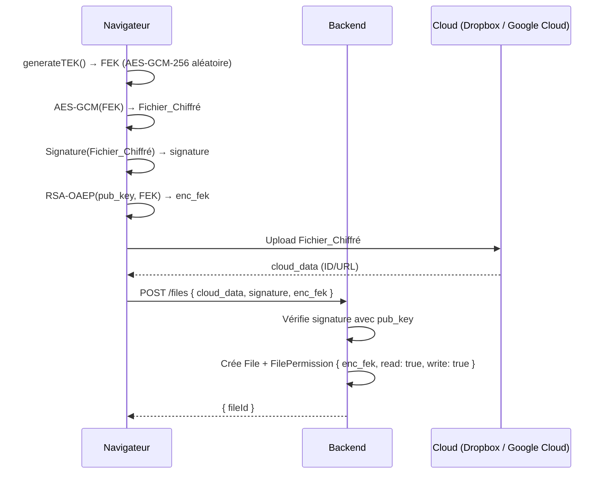
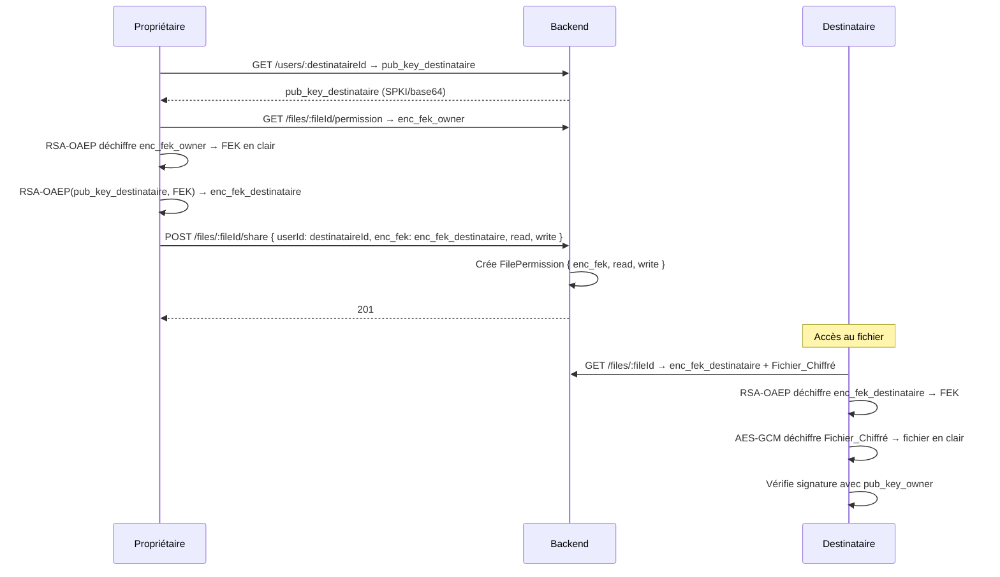
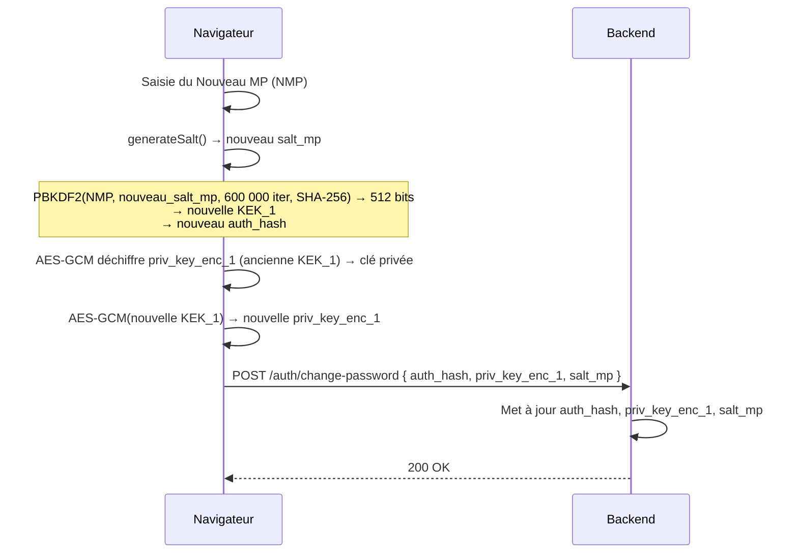
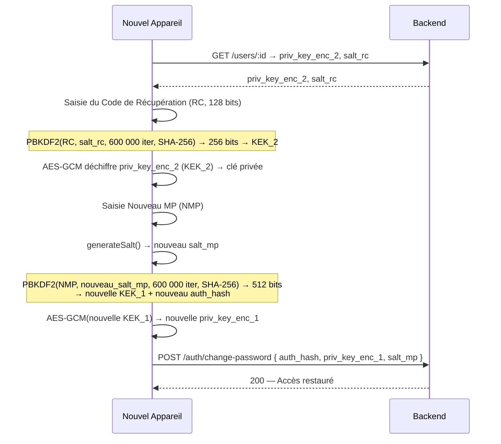
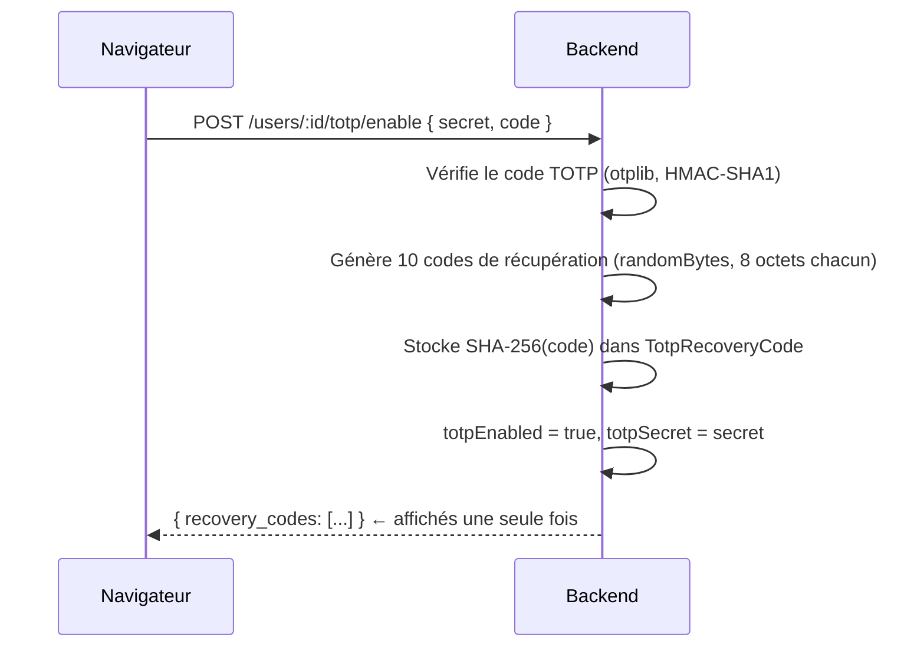
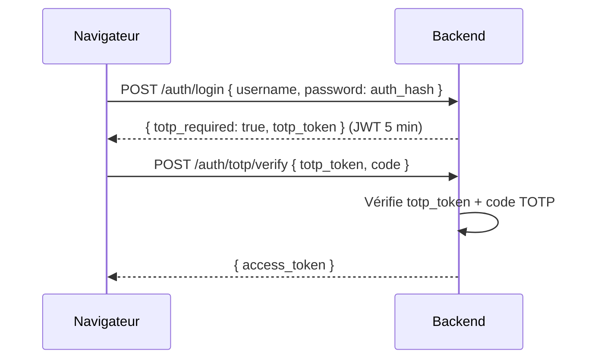

# Schémas des Flux Cryptographiques

> **Principe fondamental :** toute la cryptographie s'exécute côté client dans le navigateur (Web Crypto API). Le serveur ne reçoit jamais le mot de passe maître, les clés privées déchiffrées, ni aucun fichier en clair.

---

## 1. Inscription et Génération des Clés

Un seul appel PBKDF2 produit 512 bits, découpés en KEK_1 (32 premiers octets) et auth_hash (32 derniers octets), pour éviter deux dérivations coûteuses.

> `auth_hash` est calculé côté client via PBKDF2 et envoyé tel quel. Le serveur le stocke et le compare ultérieurement avec `timingSafeEqual` — **aucun hachage supplémentaire côté serveur**.

---

## 2. Connexion Locale

---

## 3. Connexion OIDC avec Preuve de Clé (Challenge RSA)

Lorsqu'un utilisateur se connecte via Google/Rezel/Dropbox, le serveur doit vérifier qu'il détient bien la clé privée (et donc connaît son MP) avant d'émettre un JWT complet. Ce flux évite d'envoyer le MP ou la KEK au serveur.

> Ce challenge-response prouve la possession de la clé privée (et donc du MP) **sans jamais transmettre la KEK ou le MP au serveur**.

---

## 4. Mise à Jour de l'Arbre (UserTree)

---

## 5. Upload et Chiffrement d'un Fichier

---

## 6. Partage d'un Fichier

Le serveur ne voit jamais la FEK en clair — il manipule uniquement des FEK chiffrées par clé publique RSA.

> **Révocation :** à la révocation d'un accès, le propriétaire regénère une nouvelle FEK, re-chiffre le fichier, et re-distribue la FEK à tous les accès restants. La FEK compromise ne permet plus de déchiffrer le nouveau blob.

---

## 7. Changement de Mot de Passe Maître

Le re-chiffrement se fait entièrement côté client. Le serveur reçoit uniquement les nouveaux artefacts déjà calculés.

> `priv_key_enc_2` et `salt_rc` ne changent pas — ils dépendent du code de récupération (RC), pas du MP.

---

## 8. Récupération de Compte (Code de Récupération)

Permet de restaurer l'accès si l'utilisateur perd son appareil et son mot de passe maître.

---

## 9. Double Facteur TOTP

### Activation

### Connexion avec TOTP

