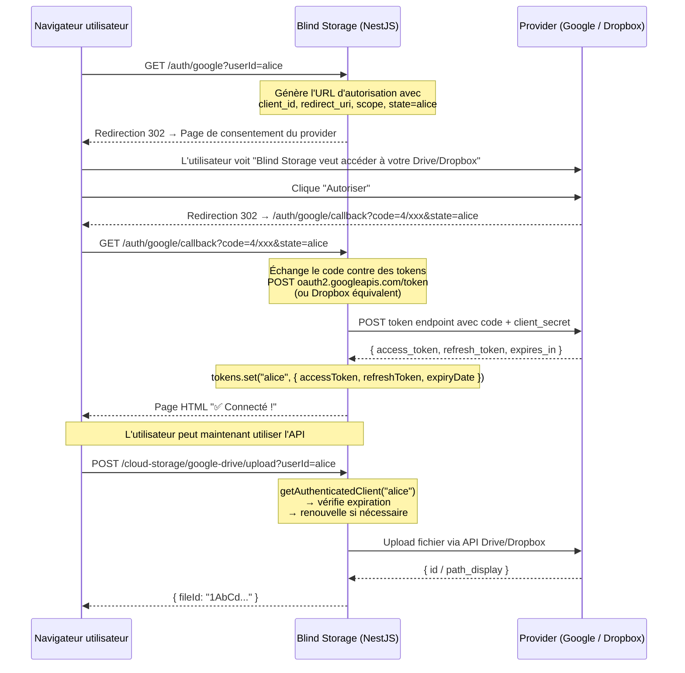

# ☁️ Module Cloud Storage — Documentation complète

Ce module permet à Blind Storage de stocker des fichiers chiffrés sur **Google Drive** et **Dropbox**. Chaque utilisateur connecte son propre compte — les fichiers sont stockés dans son espace personnel. Le serveur ne voit jamais le contenu en clair.

---

## Sommaire

1. [Architecture](#1-architecture)
2. [Variables d'environnement](#2-variables-denvironnement)
3. [Configurer Google Drive](#3-configurer-google-drive)
4. [Configurer Dropbox](#4-configurer-dropbox)
5. [Flow de connexion OAuth2](#5-flow-de-connexion-oauth2)
6. [Gestion des tokens](#6-gestion-des-tokens)
7. [Référence complète des routes](#7-référence-complète-des-routes)
8. [Organisation des fichiers chez les providers](#8-organisation-des-fichiers-chez-les-providers)
9. [Lancer les tests](#9-lancer-les-tests)
10. [Erreurs courantes](#10-erreurs-courantes)
11. [Ajouter un nouveau provider](#11-ajouter-un-nouveau-provider)
12. [Limites actuelles et évolutions](#12-limites-actuelles-et-évolutions)

---

## 1. Architecture

### Structure des fichiers

```
src/
  auth/
    google/
      google-auth.service.ts      ← Génère les URLs OAuth2, stocke et renouvelle les tokens Google
      google-auth.controller.ts   ← Routes /auth/google/* (connexion, callback, status, tokens)
      google-auth.module.ts       ← Déclare et exporte GoogleAuthService
    dropbox/
      dropbox-auth.service.ts     ← Même rôle pour Dropbox
      dropbox-auth.controller.ts  ← Routes /auth/dropbox/*
      dropbox-auth.module.ts      ← Déclare et exporte DropboxAuthService
  cloud-storage/
    providers/
      cloud-storage-provider.interface.ts  ← Interface commune (uploadFile, downloadFile, deleteFile, listFiles)
      google-drive.service.ts              ← Implémente l'interface via Google Drive API v3
      dropbox.service.ts                   ← Implémente l'interface via Dropbox SDK
    cloud-storage.service.ts     ← Reçoit le nom du provider et délègue au bon service
    cloud-storage.controller.ts  ← Routes /cloud-storage/:provider/*
    cloud-storage.module.ts      ← Assemble tout le module
```

### Flux de données

```
Requête HTTP
    │
    ▼
CloudStorageController          ← reçoit :provider dans l'URL ("google-drive" ou "dropbox")
    │
    ▼
CloudStorageService             ← choisit GoogleDriveService ou DropboxService
    │
    ├──▶ GoogleDriveService     ← demande un client authentifié à GoogleAuthService
    │         │                    puis appelle Google Drive API v3
    │         ▼
    │    GoogleAuthService      ← fournit un OAuth2Client avec les tokens de l'utilisateur
    │
    └──▶ DropboxService         ← demande les tokens à DropboxAuthService
              │                    puis crée un client Dropbox SDK
              ▼
         DropboxAuthService     ← fournit access_token + refresh_token de l'utilisateur
```

### L'interface commune

Tous les providers implémentent la même interface (`cloud-storage-provider.interface.ts`), ce qui permet de les interchanger sans toucher au controller :

```typescript
interface CloudStorageProvider {
  uploadFile(fileName: string, fileBuffer: Buffer, mimeType: string, userId: string): Promise<string>
  downloadFile(fileId: string, userId: string): Promise<Buffer>
  deleteFile(fileId: string, userId: string): Promise<void>
  listFiles(userId: string): Promise<FileMetadata[]>
}
```

---

## 2. Variables d'environnement

Copier `.env.example` en `.env` et remplir les valeurs :

```bash
cp .env.example .env
```

```env
# ─── Google Drive ────────────────────────────────────────────────────────────
GOOGLE_CLIENT_ID=123456789-xxxx.apps.googleusercontent.com
GOOGLE_CLIENT_SECRET=GOCSPX-xxxxxxxxxxxxxxxxxxxx
GOOGLE_REDIRECT_URI=http://localhost:3000/auth/google/callback

# ─── Dropbox ─────────────────────────────────────────────────────────────────
DROPBOX_APP_KEY=xxxxxxxxxxxxxxx
DROPBOX_APP_SECRET=xxxxxxxxxxxxxxx
DROPBOX_REDIRECT_URI=http://localhost:3000/auth/dropbox/callback
```

> En production, remplacer `http://localhost:3000` par le domaine réel dans les deux `REDIRECT_URI`. L'URI doit être **identique** à celle enregistrée dans la console du provider (caractère pour caractère).

---

## 3. Configurer Google Drive

Google Drive nécessite une application OAuth2 enregistrée sur Google Cloud. Chaque utilisateur autorise ensuite cette application à accéder à son Drive personnel.

### Étape 1 — Créer un projet Google Cloud

1. Aller sur [console.cloud.google.com](https://console.cloud.google.com)
2. Menu déroulant en haut → **Nouveau projet**
3. Donner un nom (ex: `blind-storage`) → **Créer**

### Étape 2 — Activer l'API Google Drive

1. Menu → **APIs et services** → **Bibliothèque**
2. Rechercher `Google Drive API` → **Activer**

### Étape 3 — Configurer l'écran de consentement OAuth

C'est la page que les utilisateurs verront quand ils autorisent l'application.

1. Menu → **APIs et services** → **Écran de consentement OAuth**
2. Choisir **Externe** → **Créer**
3. Remplir :
   - **Nom de l'application** : `Blind Storage`
   - **Email d'assistance** : ton adresse email
   - Laisser vide le reste en développement
4. Cliquer **Enregistrer et continuer** sur tous les écrans suivants

### Étape 4 — Ajouter les utilisateurs test ⚠️

L'application est par défaut en **mode Test**. Dans cet état, Google bloque toute connexion avec une erreur `403 access_denied` — **même pour le compte du développeur**.

1. Sur la même page **Écran de consentement OAuth**
2. Section **Utilisateurs test** → **+ Add users**
3. Ajouter les adresses Gmail qui vont tester l'application
4. **Save**

> Pour un déploiement public (n'importe qui peut se connecter), il faut passer en mode **Production** et soumettre l'application à la vérification de Google. Ce processus prend quelques jours.

### Étape 5 — Créer les credentials OAuth2

1. Menu → **APIs et services** → **Identifiants**
2. **+ Créer des identifiants** → **ID client OAuth**
3. Type : **Application Web**
4. **URI de redirection autorisés** → **+ Ajouter un URI** :
   - `http://localhost:3000/auth/google/callback` (développement)
   - `https://ton-domaine.com/auth/google/callback` (production)
5. **Créer**

Une popup affiche le **Client ID** et le **Client Secret**. Les copier dans le `.env` :

```env
GOOGLE_CLIENT_ID=165311097616-xxxx.apps.googleusercontent.com
GOOGLE_CLIENT_SECRET=GOCSPX-xxxxxxxxxxxxxxxxxxxx
GOOGLE_REDIRECT_URI=http://localhost:3000/auth/google/callback
```

### Ce que le scope `drive.file` signifie

L'application demande le scope `https://www.googleapis.com/auth/drive.file`. Ce scope restreint donne accès **uniquement aux fichiers créés par Blind Storage** dans le Drive de l'utilisateur. L'application ne peut pas lire les autres fichiers existants — c'est intentionnel (principe du moindre privilège).

---

## 4. Configurer Dropbox

### Étape 1 — Créer une application Dropbox

1. Aller sur [dropbox.com/developers/apps](https://www.dropbox.com/developers/apps)
2. Cliquer **Create app**
3. Choisir :
   - **Scoped access**
   - **Full Dropbox** (accès à tout le Dropbox de l'utilisateur)
4. Donner un nom (ex: `blind-storage`) → **Create app**

### Étape 2 — Configurer les permissions

Dans l'onglet **Permissions**, cocher :

| Permission | Rôle |
|---|---|
| `files.content.read` | Télécharger des fichiers |
| `files.content.write` | Uploader et supprimer des fichiers |
| `files.metadata.read` | Lister les fichiers |

Cliquer **Submit** pour enregistrer.

### Étape 3 — Ajouter l'URI de redirection ⚠️

Dans l'onglet **Settings** → section **OAuth 2** → **Redirect URIs** :

Entrer exactement (sans espace ni slash final) :
```
http://localhost:3000/auth/dropbox/callback
```

Cliquer **Add**. Si cette URI ne correspond pas exactement à `DROPBOX_REDIRECT_URI` dans le `.env`, Dropbox retourne une erreur `Invalid redirect_uri`.

### Étape 4 — Récupérer les credentials

Toujours dans l'onglet **Settings** :

- **App key** → copier dans `DROPBOX_APP_KEY`
- **App secret** → cliquer **Show** → copier dans `DROPBOX_APP_SECRET`

```env
DROPBOX_APP_KEY=y380v41li3pm8px
DROPBOX_APP_SECRET=xxxxxxxxxxxxxxx
DROPBOX_REDIRECT_URI=http://localhost:3000/auth/dropbox/callback
```

---

## 5. Flow de connexion OAuth2

Les deux providers utilisent le même protocole **OAuth2 avec code d'autorisation**. La différence est uniquement dans les URLs et les SDKs utilisés.

### Flow complet (identique pour Google Drive et Dropbox)



### Connexion Google Drive

```
GET /auth/google?userId=<identifiant>
```

Redirige vers `accounts.google.com/o/oauth2/v2/auth` avec :
- `client_id` — identifie l'application
- `redirect_uri` — où Google rappelle après consentement
- `scope` — `drive.file` (fichiers créés par l'app seulement)
- `access_type=offline` — pour recevoir un refresh_token
- `prompt=consent` — force Google à renvoyer un refresh_token à chaque fois
- `state=userId` — pour retrouver l'utilisateur au callback

### Connexion Dropbox

```
GET /auth/dropbox?userId=<identifiant>
```

Redirige vers `www.dropbox.com/oauth2/authorize` avec :
- `client_id` — identifie l'application (App Key)
- `redirect_uri` — où Dropbox rappelle après consentement
- `token_access_type=offline` — pour recevoir un refresh_token
- `response_type=code` — flow avec code d'autorisation
- `state=userId` — pour retrouver l'utilisateur au callback

---

## 6. Gestion des tokens

### Les deux types de tokens

| Token | Durée de vie | Rôle |
|---|---|---|
| `access_token` | ~1 heure (Google) / ~4 heures (Dropbox) | Envoyé dans chaque appel API (`Authorization: Bearer ...`) |
| `refresh_token` | Permanent (jusqu'à révocation) | Permet d'obtenir un nouvel `access_token` sans redemander à l'utilisateur |

Le `refresh_token` n'est renvoyé **qu'une seule fois**, lors de la première connexion. C'est pour ça que :
- Google : `prompt: 'consent'` est forcé — sans lui, Google ne renvoie pas le `refresh_token` si l'utilisateur avait déjà autorisé l'app
- Dropbox : `tokenAccessType: 'offline'` est requis — sans lui, Dropbox renvoie uniquement un `access_token` à courte durée

### Stockage actuel (mémoire)

Les tokens sont stockés dans une `Map<userId, tokens>` en mémoire dans `GoogleAuthService` et `DropboxAuthService` :

```typescript
private readonly tokens = new Map<string, UserTokens>();
```

**Conséquence directe :** les tokens sont perdus à chaque redémarrage du serveur. L'utilisateur doit se reconnecter.

### Renouvellement automatique (Google Drive uniquement)

`GoogleAuthService.getAuthenticatedClient()` vérifie l'expiration avant chaque appel API. Si le token expire dans moins de 5 minutes, il en demande un nouveau automatiquement :

```typescript
if (stored.expiryDate < Date.now() + 5 * 60 * 1000) {
  const { credentials } = await client.refreshAccessToken();
  this.tokens.set(userId, { ...newCredentials });
}
```

Pour Dropbox, le SDK gère le renouvellement automatiquement si `refreshToken`, `clientId` et `clientSecret` sont fournis lors de la création du client.

### Vérifier les tokens en cours de session

```bash
# Google Drive
curl http://localhost:3000/auth/google/tokens?userId=alice

# Dropbox
curl http://localhost:3000/auth/dropbox/tokens?userId=alice
```

Réponse :
```json
{
  "userId": "alice",
  "connected": true,
  "tokens": {
    "accessToken": "ya29.a0AfB_byC3...",
    "refreshToken": "1//0gABC123...",
    "expiresAt": "2026-05-09T17:30:00.000Z",
    "expiresInSeconds": 3542
  }
}
```

### Persistance en production

Quand PostgreSQL et Prisma seront intégrés, il faudra remplacer la `Map` par une table en base de données. La modification ne concerne que `GoogleAuthService` et `DropboxAuthService` — le reste du code ne change pas.

```
Table user_tokens
──────────────────────────────────────────────────────────────────
userId | provider     | accessToken | refreshToken | expiresAt
───────|──────────────|-------------|──────────────|────────────────
alice  | google-drive | ya29.xxx    | 1//xxx       | 1735689600000
alice  | dropbox      | sl.xxx      | xxxxxxxxx    | 1735703600000
bob    | google-drive | ya29.yyy    | 1//yyy       | 1735693200000
```

---

## 7. Référence complète des routes

### Routes d'authentification Google Drive

| Méthode | Route | Paramètres | Description |
|---|---|---|---|
| `GET` | `/auth/google` | `?userId=` | Lance le flow OAuth2 — redirige vers Google |
| `GET` | `/auth/google/callback` | `?code=&state=` | Callback automatique de Google — ne pas appeler manuellement |
| `GET` | `/auth/google/status` | `?userId=` | Vérifie si l'utilisateur est connecté |
| `GET` | `/auth/google/tokens` | `?userId=` | Affiche les tokens (debug uniquement) |
| `DELETE` | `/auth/google/disconnect` | `?userId=` | Supprime les tokens de la mémoire |

### Routes d'authentification Dropbox

| Méthode | Route | Paramètres | Description |
|---|---|---|---|
| `GET` | `/auth/dropbox` | `?userId=` | Lance le flow OAuth2 — redirige vers Dropbox |
| `GET` | `/auth/dropbox/callback` | `?code=&state=` | Callback automatique de Dropbox — ne pas appeler manuellement |
| `GET` | `/auth/dropbox/status` | `?userId=` | Vérifie si l'utilisateur est connecté |
| `GET` | `/auth/dropbox/tokens` | `?userId=` | Affiche les tokens (debug uniquement) |
| `DELETE` | `/auth/dropbox/disconnect` | `?userId=` | Supprime les tokens de la mémoire |

### Routes de stockage

Le paramètre `:provider` vaut `google-drive` ou `dropbox`. Toutes les routes prennent `?userId=`.

#### Lister les fichiers

```
GET /cloud-storage/:provider/files?userId=<userId>
```

Retourne les fichiers de l'utilisateur dans son espace dédié.

```json
{
  "files": [
    {
      "id": "1AbCdEfGhIjKlMnOpQrStUvWxYz",
      "name": "document.enc",
      "size": 4096,
      "createdAt": "2026-05-09T10:30:00.000Z",
      "mimeType": "application/octet-stream"
    }
  ]
}
```

> Pour Google Drive, `id` est un identifiant opaque (ex: `1AbCdEfGhI...`).
> Pour Dropbox, `id` est le chemin complet (ex: `/alice/document.enc`).

#### Uploader un fichier

```
POST /cloud-storage/:provider/upload?userId=<userId>
Content-Type: multipart/form-data
```

Le fichier doit être dans un champ nommé **`file`**.

```json
{
  "fileId": "1AbCdEfGhIjKlMnOpQrStUvWxYz",
  "message": "Fichier uploadé avec succès"
}
```

**Important :** conserver le `fileId` retourné — c'est l'identifiant à utiliser pour télécharger ou supprimer. Pour Dropbox, c'est un chemin (`/userId/nom.enc`) ; pour Google Drive, c'est un ID opaque.

#### Télécharger un fichier

```
GET /cloud-storage/:provider/download?userId=<userId>&fileId=<fileId>
```

Le `fileId` est passé en **query parameter** (pas dans le chemin) pour éviter les problèmes avec les `/` dans les chemins Dropbox.

Retourne le contenu brut du fichier (`Content-Type: application/octet-stream`).

#### Supprimer un fichier

```
DELETE /cloud-storage/:provider/files?userId=<userId>&fileId=<fileId>
```

Retourne `204 No Content` en cas de succès.

---

## 8. Organisation des fichiers chez les providers

### Google Drive

Lors du premier upload d'un utilisateur, `GoogleDriveService` crée automatiquement un dossier `Blind Storage` dans le Drive personnel de l'utilisateur. Tous les fichiers gérés par l'application y sont rangés.

```
Mon Google Drive/
  └── Blind Storage/              ← créé automatiquement au premier upload
        ├── document.enc
        ├── photo.enc
        └── archive.enc
```

Le dossier est retrouvé à chaque opération via une recherche par nom (`files.list` avec filtre). Si le dossier est supprimé manuellement depuis Drive, il sera recréé au prochain upload.

Le scope `drive.file` garantit que l'application **ne peut pas voir** les autres fichiers du Drive de l'utilisateur — uniquement ceux dans ce dossier.

### Dropbox

Les fichiers sont organisés dans un dossier `/userId/` à la racine du Dropbox de l'utilisateur.

```
Mon Dropbox/
  └── alice/                      ← nom = userId passé à l'API
        ├── document.enc
        └── photo.enc
```

Le `fileId` retourné par Dropbox est le **chemin complet** du fichier (ex: `/alice/document.enc`). C'est ce chemin qu'il faut utiliser pour télécharger ou supprimer.

> **Différence clé** : Google Drive utilise des IDs opaques (`1AbCd...`), Dropbox utilise des chemins (`/alice/fichier.enc`). Les deux sont passés en `?fileId=` dans les routes de download et delete.

---

## 9. Lancer les tests

Deux scripts de test sont disponibles dans le dossier `test/`. Ils testent l'intégralité du cycle upload → liste → download → suppression.

### Prérequis

Le serveur doit tourner dans un terminal séparé :

```bash
npm run start:dev
```

### Test Google Drive

```bash
node test/test-drive.mjs
```

Le script :
1. Vérifie si l'utilisateur `test-drive` est déjà connecté
2. Si non, affiche l'URL à ouvrir dans le navigateur et attend
3. Affiche les tokens une fois connecté
4. Upload un fichier texte, vérifie qu'il est dans la liste, le télécharge, compare le contenu, puis le supprime

### Test Dropbox

```bash
node test/test-dropbox.mjs
```

Même déroulé, avec l'utilisateur `test-dropbox` et le provider Dropbox.

---

## 10. Erreurs courantes

### `403 access_denied` — Google Drive

```
Blind Storage n'a pas terminé la procédure de validation de Google
```

**Cause :** l'app est en mode Test et l'email utilisé n'est pas dans la liste des utilisateurs autorisés.

**Fix :** Google Cloud Console → **APIs et services** → **Écran de consentement OAuth** → **Utilisateurs test** → **+ Add users** → ajouter l'adresse Gmail.

---

### `Invalid redirect_uri` — Dropbox

```
Invalid redirect_uri. It must exactly match one of the redirect URIs you've pre-configured for your app.
```

**Cause :** l'URI dans `DROPBOX_REDIRECT_URI` ne correspond pas exactement à celle enregistrée dans le Dropbox App Console.

**Fix :** Dropbox App Console → onglet **Settings** → **OAuth 2** → **Redirect URIs** → vérifier que `http://localhost:3000/auth/dropbox/callback` est bien présent (sans slash final, sans espace).

---

### `invalid_grant` — Google Drive

```
GaxiosError: invalid_grant
```

**Cause :** le code d'autorisation Google a expiré (il est valide ~5 minutes et à usage unique). Se produit si le serveur a redémarré entre la génération de l'URL et le callback.

**Fix :** relancer le flow — retourner sur `/auth/google?userId=xxx`.

---

### `401 Unauthorized` — après redémarrage du serveur

**Cause :** les tokens sont en mémoire et ont été perdus au redémarrage.

**Fix :** se reconnecter via `/auth/google?userId=xxx` ou `/auth/dropbox?userId=xxx`.

---

### `redirect_uri_mismatch` — Google Drive

```
Error 400: redirect_uri_mismatch
```

**Cause :** `GOOGLE_REDIRECT_URI` dans le `.env` ne correspond pas exactement à l'URI enregistrée dans Google Cloud Console.

**Fix :** Google Cloud Console → **Identifiants** → cliquer sur l'ID client → vérifier les **URI de redirection autorisés**.

---

## 11. Ajouter un nouveau provider

L'interface commune garantit qu'ajouter un provider ne modifie rien au code existant.

### Étape 1 — Créer le service auth

`src/auth/onedrive/onedrive-auth.service.ts` — gère les tokens par utilisateur (même structure que `GoogleAuthService` ou `DropboxAuthService`).

### Étape 2 — Créer le service storage

`src/cloud-storage/providers/onedrive.service.ts` — implémente `CloudStorageProvider` :

```typescript
@Injectable()
export class OneDriveService implements CloudStorageProvider {
  async uploadFile(fileName, fileBuffer, mimeType, userId): Promise<string> { ... }
  async downloadFile(fileId, userId): Promise<Buffer> { ... }
  async deleteFile(fileId, userId): Promise<void> { ... }
  async listFiles(userId): Promise<FileMetadata[]> { ... }
}
```

### Étape 3 — Enregistrer dans les modules

Dans `cloud-storage.module.ts` :
```typescript
imports: [ConfigModule, GoogleAuthModule, DropboxAuthModule, OneDriveAuthModule],
providers: [CloudStorageService, GoogleDriveService, DropboxService, OneDriveService],
```

### Étape 4 — Ajouter le cas dans le switch

Dans `cloud-storage.service.ts`, méthode `getProvider()` :
```typescript
case 'onedrive':
  return this.oneDriveService;
```

Le controller et toutes les routes existantes fonctionnent immédiatement.

---

## 12. Limites actuelles et évolutions

### Tokens en mémoire

Les tokens OAuth2 sont stockés dans des `Map` en mémoire. Ils sont perdus au redémarrage du serveur. **À corriger en priorité** quand PostgreSQL et Prisma seront intégrés : persister les tokens dans une table `user_tokens`.

### Taille des fichiers

Le module utilise des `Buffer` en mémoire. Pour les gros fichiers (> quelques centaines de Mo), il faudra passer à un système de streams pour éviter de saturer la mémoire du serveur.

### Renouvellement Dropbox

Pour Google Drive, le renouvellement du token est géré manuellement dans `GoogleAuthService`. Pour Dropbox, il est délégué au SDK (qui utilise le `refreshToken` + `clientId` + `clientSecret` passés à la création du client). Si le SDK ne parvient pas à renouveler, l'utilisateur recevra une erreur `401` et devra se reconnecter.

### Chiffrement

Le module stocke actuellement les fichiers **tels quels**. Dans l'architecture finale de Blind Storage, les fichiers arrivent déjà chiffrés depuis le client (AES-GCM avec une FEK chiffrée par la clé publique de l'utilisateur). Ce module n'a alors qu'un rôle de relais — il n'a pas à être modifié pour supporter le chiffrement côté client.
